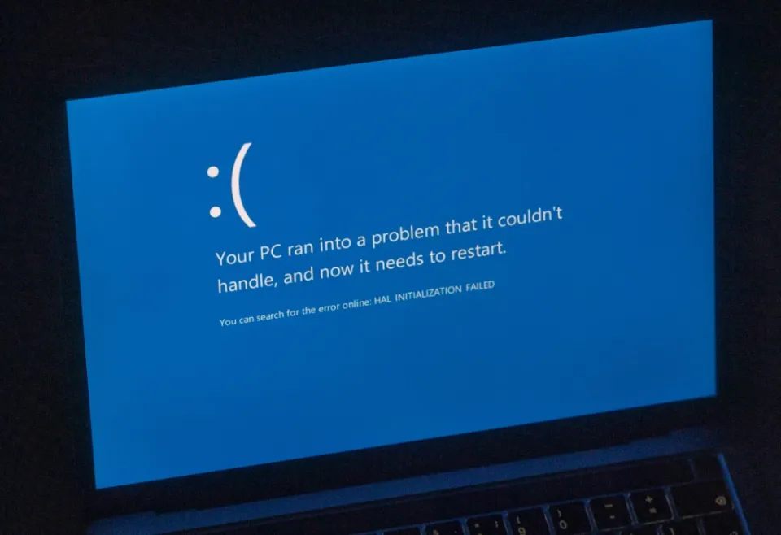

<div align="center">

# <span style="color: #1E90FF;">K</span><span style="color: #FF5733;">A</span><span style="color: #2ECC71;">R</span><span style="color: #F1C40F;">E</span><span style="color: #9B59B6;">E</span><span style="color: #E74C3C;">M</span> <span style="color: #3498DB;">D</span><span style="color: #E67E22;">A</span><span style="color: #2ECC71;">R</span><span style="color: #F1C40F;">K</span><span style="color: #1ABC9C;">.</span><span style="color: #9B59B6;">e</span><span style="color: #E74C3C;">x</span><span style="color: #3498DB;">e</span>

### *Permanent Windows System Destruction Utility*

</div>

---


<p align="center">
  
</p>

---

## ⚠️ Legal Warning

This program is a **destructive system utility** designed to irreversibly damage Windows-based operating systems.  
It executes destructive actions at the system level, such as overwriting the boot sector, deleting critical registry hives, encrypting files, and initiating an immediate forced reboot.

This project is provided **strictly for local experimental use** within isolated test environments.  
**Running this tool on any system you do not fully own and control is illegal and unethical.**  
The author holds **no responsibility or liability** for any damage caused.

---

## What SystemAnnihilator Does

- Elevates the process to critical system-level privileges.
- Overwrites the Master Boot Record (MBR), breaking system startup.
- Corrupts or removes core operating system files and directories.
- Wipes essential Windows registry hives (e.g., SAM, SYSTEM).
- Encrypts system and user files using AES-256 encryption.
- Overwrites unallocated disk space to prevent file recovery.
- Displays a final on-screen warning before execution.
- Forces an immediate reboot after completing all operations.

---

## Important Notices

- **This program is irreversible** — data loss is permanent.
- **No recovery is possible** after execution.
- Intended for **virtual machines** or **controlled environments only**.
- Never share, modify, or distribute this tool.
- You assume **full legal and ethical responsibility** for any action taken with it.

---

## Usage

SystemAnnihilator is compiled into a single `.exe` binary for Windows.  
It must be executed with **Administrator privileges** to perform its intended functions.

```bash
# Example (Not Included):
./SystemAnnihilator.exe
ذذذ```
```

---

#  Source Code Availability

The executable (`.exe`) is shared strictly for **controlled testing and documentation purposes only**.  
The **source code is intentionally not included** in this repository to prevent unauthorized use, replication, or modification.  
This precaution is taken to reduce the risk of **malicious reuse** or **reverse engineering**.

---
